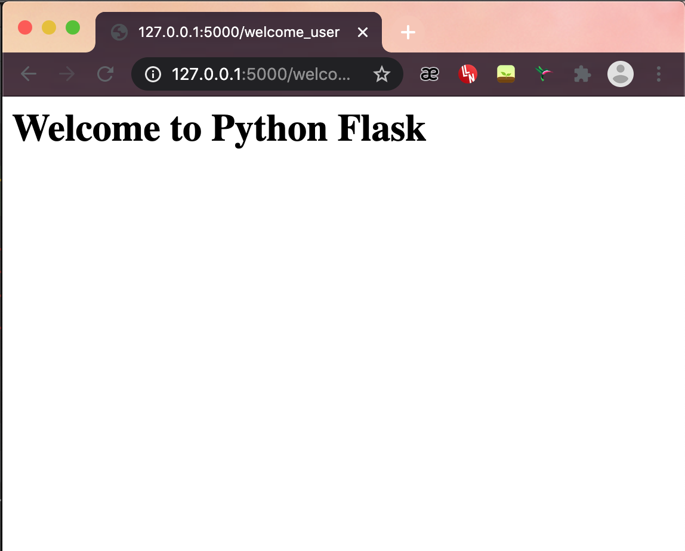

# First Flask Project :snake:

## Installing flask 
```bash
$ pip install Flask
```
## Importing flask 
```python
from flask import Flask
```

## Using `render_template` method to use HTML files
**N.B.** Flask will look for templates in the `templates` folder
```python
from flask import render_template
def hello(name=None):
    render_template('hello.html' ,name=name)
```


## Running flask 
```bash
export FLASK_APP=filename.py
$ flask run
OR
$ export FLASK_APP=filename.py
python -m flask run
```

### Refreshing changes without re-running the program:
```python
if __name__ == '__main__':
    app.run(debug=True)
```

## Syntax to create flask instance
```python
app = Flask(__name__)
```

## Default page 
```python
@app.route('/')
def index():
    return "Hello World"
```

## Creating a welcome method 
```python
@app.route('/welcome')
def welcome():
    render_template('home.html')
```

**Running `app.py` file**

Run http://127.0.0.1:5000/


**Running `app.py` file**

Run http://127.0.0.1:5000/welcome_user


## Exercise Files:

- [x] [Main Home Page](app.py)
- [x] [Static Files - CSS](static)
- [x] [HTML documents](templates)
